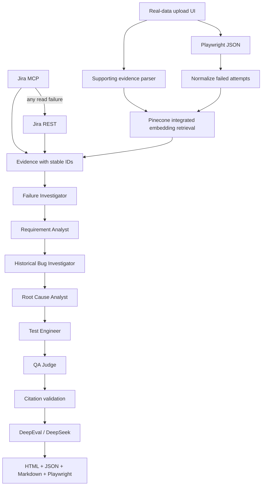

# Architecture

CrewAI executes six bounded sequential tasks. Each receives source evidence and preceding task outputs. A custom BaseLLM routes each completion through the primary and then fallback provider. Tasks do not have shell or mutation tools. Retrieved material is explicitly treated as untrusted evidence. Known citation IDs are checked before output is written; this checks referential integrity, not semantic truth. DeepEval separately judges groundedness and regression usefulness.

Live evidence uses Pinecone integrated embedding and namespaced records. Jira enrichment is explicitly requested with a key. Every failed Playwright attempt is retained, including eventual flakes and project names. Attachments are metadata only. Reports preserve provider/transport events and individual agent outputs, while errors record only exception types.

Offline mode replaces external systems with lexical retrieval and a transparent fixture analysis. It shares parsing, citation validation, and reporting with live mode. It never emits synthetic DeepEval scores.

The upload UI accepts one Playwright report and supporting evidence files. It validates size and type, converts structured rows and text chunks into evidence records, and stores the originals in a unique run directory. Pinecone uses a unique namespace for each uploaded run. Newly uploaded records are merged with a bounded local match while Pinecone's integrated index becomes consistent. The checked-in `demo/` directory is served separately and never written by this flow.

Production additions: authenticated submission and tenant scopes, queue/durable results, record version filters, ingestion chunking, trace/screenshot extraction, token budgets, operational telemetry, redaction policy, and a reviewed regression execution sandbox. Do not use the static Vercel demo as a live multi-user backend.
