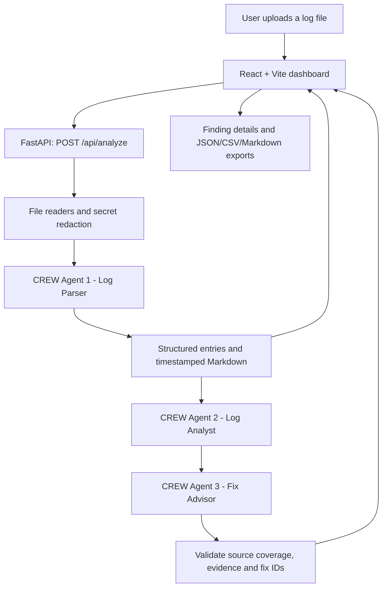

# Logscope — CrewAI Log Analyzer

Logscope helps QA engineers and developers investigate uploaded logs through a React dashboard and a FastAPI/CrewAI backend. One sequential CrewAI crew contains exactly three agents that parse uploaded logs, analyze the resulting Markdown for issues, and propose possible fixes while keeping request and response context available for inspection.

## Live deployments

- Frontend: https://log-analyzer-ca.vercel.app
- API: https://log-analyzer-ca-api.vercel.app

The backend is a separate Vercel project so its Python 3.12 dependencies are built independently from Vite. Both projects live in this directory. The hosted API requires a provider key in its production environment. Until that is configured, it returns an explicit setup error; it does not substitute rule-based results for CrewAI analysis.

## Features

- Upload JSON, CSV, XLS, XLSX, PDF, DOC, DOCX, HAR, and Charles XML/JSON exports (including `.chlsj`).
- Parse each file into a downloadable `logfile_<UTC timestamp>.md` with source, message, timestamp, session ID, HTTP context, and redacted headers.
- Detect issues, errors, timeouts, warnings, and failures. Inspect each finding's request, response, headers, message, timestamp, session ID, and suggested fixes.
- Run CrewAI parsing, analysis, and remediation agents using Command Code DeepSeek V4.1 Flash first, then Groq `openai/gpt-oss-120b`. If a provider fails or produces invalid output, the entire batch is retried on the fallback. If both fail, analysis returns an explicit error.
- Export one finding, selected findings, or all findings as JSON; export selected findings as CSV. Suggested fixes can be included or excluded.
- Midnight and Charcoal night themes, Sand and Cloud light themes.

## Architecture

The React frontend and Python API deploy as two Vercel projects. File readers decode binary containers and JSON embedded in CSV cells, then preserve source records for the CrewAI parser. Every record then passes through the three AI stages; coverage and evidence checks reject incomplete or invalid output.



| Stage | CrewAI responsibility | Output |
| --- | --- | --- |
| CREW Agent 1 - Log Parser | Interpret every source record, including free text and nested fields; extract messages, timestamps, session IDs, HTTP bodies and headers | Validated structured entries, rendered into `logfile_<timestamp>.md` |
| CREW Agent 2 - Log Analyst | Read the actual parsed Markdown, review every source ID, and identify issues, errors, timeouts, warnings and failures | Classified findings with quoted evidence and an explanation |
| CREW Agent 3 - Fix Advisor | Review all findings and their HTTP context; propose 1-3 possible fixes or diagnostic steps per finding | Suggestions mapped to every finding ID |

Each batch runs a single `Crew` with three distinct `Agent` objects and three `Task` objects using `Process.sequential`:

```python
Crew(
    agents=[parser_agent, analyst_agent, advisor_agent],
    tasks=[parse_task, analyze_task, suggest_task],
    process=Process.sequential,
).kickoff()
```

Agent 1 receives the user file's extracted source records. Its task guardrail validates every source ID and renders the parsed output into Markdown. Agent 2 receives that Markdown through `context=[parse_task]` and identifies failures, warnings, errors, timeouts, and other issues. Its guardrail checks coverage and quoted evidence, then passes findings with stable IDs and HTTP details to Agent 3 through `context=[analyze_task]`. Agent 3 analyzes those findings and returns one to three possible fixes for each. An invalid handoff gets one correction attempt with the original source context preserved. If validation still fails, provider fallback reruns the complete three-agent crew. Errors identify the provider, failing stage, and safe failure category.

File decoding, Markdown formatting, and schema validation are ordinary Python operations supporting the three agents.

The implementation uses a `LogAnalysisCrew` subclass of CrewAI `Crew` with execution history held in request-local memory. This avoids shared SQLite task history in serverless workers; agent execution, task handoffs, guardrails, and sequential orchestration remain CrewAI operations.

| Component | Location | Responsibility |
| --- | --- | --- |
| Dashboard | `src/main.jsx`, `src/styles.css` | Uploads, pipeline status, filters, evidence, details, themes, exports |
| API | `backend/api/index.py` | Upload validation, CrewAI orchestration in a worker thread, health endpoint, CORS |
| File readers | `backend/api/parser.py` | Decode file containers, retain source data, redact recognized secrets, render Markdown |
| Three CrewAI stages | `backend/api/crew_pipeline.py` | Agents, tasks, model selection, batching, output validation, fallback |
| Deployment | `vercel.json`, `backend/vercel.json` | Separate frontend and Python API builds |

The API is stateless: Markdown and findings return to the browser without an application database or persistent log storage. Missing evidence remains unavailable. All records must be covered; the service does not silently truncate or replace AI stages with keyword rules.

To keep requests within the serverless execution budget, batches target at most 6,000 serialized characters and 20 records to fit provider token limits (an individual record may contain up to 16,000 characters). A request supports up to eight batches (at most 160 source records). Inputs above these limits are rejected before AI calls with instructions to split the file. The provider fallback is Command Code to Groq, and both providers run the same three stages. Once fallback succeeds, remaining batches use Groq. Temporary provider rate limits get up to two bounded waits within the request time budget; oversized provider requests fail explicitly.

## Run locally

From this directory:

```powershell
uv venv --python 3.12 .venv
uv pip install --python .venv\Scripts\python.exe -r backend\requirements.txt
npm install
.venv\Scripts\python.exe -m uvicorn backend.api.index:app --reload --port 8000
```

In another terminal:

```powershell
npm run dev
```

The Vite development server proxies `/api` to `localhost:8000`. Put `COMMANDCODE_API_KEY` and `GROQ_API_KEY` in the project root `.env` for the local CrewAI pipeline. Keys are read by the backend only and are never exposed in the React bundle.

## Deploy

Deploy the project root to the `log-analyzer-ca` Vercel project and `backend/` to `log-analyzer-ca-api`. Set `COMMANDCODE_API_KEY` and `GROQ_API_KEY` as **production secrets on the API project**. The Vercel token is needed only by the CLI; it is not a runtime environment variable.

The backend uses no database. It returns the generated Markdown and findings in the response; the browser downloads the Markdown. No log is persisted by the app. The 4 MB upload limit stays below [Vercel's 4.5 MB request limit](https://vercel.com/docs/functions/limitations).

## Format notes

- Binary Charles `.chls` session files are Java serialization. Charles' [own CLI converts them to XML](https://www.charlesproxy.com/documentation/tools/command-line-tools/) (`charles convert session.chls session.xml`); upload that XML or a Charles JSON export. A binary `.chls` upload receives an explicit conversion message.
- Legacy binary `.doc` extraction is best effort. Save as `.docx` if text cannot be recovered.
- Scanned PDFs need OCR before upload.
- Sensitive header names and common inline token patterns are redacted before Markdown generation and CrewAI calls. Review logs for other private data before uploading; AI parsing sends redacted source records to the selected provider; the following agents receive parsed Markdown and findings.

## Checks

```powershell
.venv\Scripts\python.exe -m unittest discover -s tests -v
npm run build
```

An optional live check sends a synthetic log through the actual API and all three CrewAI stages using the local `.env`:

```powershell
.venv\Scripts\python.exe tests\smoke_live.py
```
