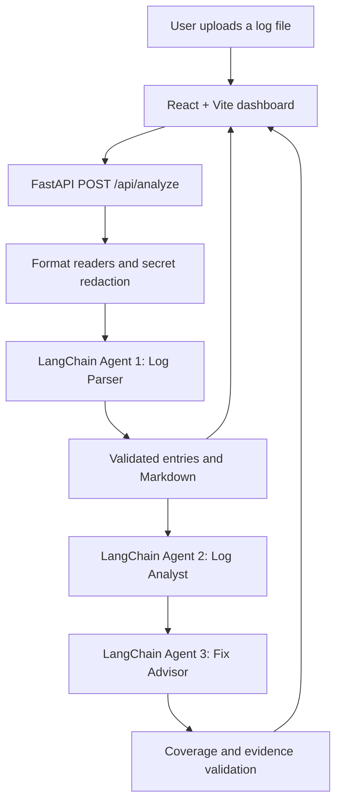

# Logscope — LangChain Log Analyzer

Logscope is a React dashboard and FastAPI service that uses three sequential LangChain agents to turn uploaded logs into structured findings and suggested fixes.

## Live deployments

- Frontend: https://log-analyzer-lc.vercel.app
- API: https://log-analyzer-lc-api.vercel.app

## Features

- Accepts JSON, CSV, XLS, XLSX, PDF, DOC, DOCX, HAR, and Charles XML/JSON exports up to 4 MB.
- Generates downloadable `logfile_<UTC timestamp>.md` output.
- Detects issues, errors, timeouts, warnings, and failures.
- Shows the request, response, headers, message, timestamp, session ID, evidence, and fixes for each finding.
- Exports one, selected, or all findings as JSON or CSV, with optional suggestions.
- Provides Midnight and Charcoal night themes plus Sand and Cloud light themes.
- Uses Command Code DeepSeek V4.1 Flash first and Groq `openai/gpt-oss-120b` as fallback.

## Architecture



| Agent | LangChain responsibility | Output |
| --- | --- | --- |
| Agent 1 — Log Parser | Receives every extracted source record and parses messages, timestamps, session IDs, requests, responses, and headers | Validated entries rendered to Markdown |
| Agent 2 — Log Analyst | Reads Agent 1's Markdown and finds failures, errors, warnings, timeouts, and other issues | Findings with exact evidence and explanations |
| Agent 3 — Fix Advisor | Reads Agent 2's validated findings and HTTP context | One to three possible fixes per finding |

Each agent is a separate LangChain `ChatPromptTemplate | ChatOpenAI | StrOutputParser` runnable. The application calls them sequentially and validates each Pydantic JSON handoff before the next agent runs. An invalid response gets one correction attempt with the original context preserved. Valid JSON wrapped in provider commentary or a code fence is extracted and still passed through the complete Pydantic schema. Transient rate limits receive bounded retries within the request deadline. If the primary provider fails, the complete batch restarts with Groq.

File readers and redaction remain ordinary Python support code. They decode containers before Agent 1 interprets the content. Uploaded logs are treated as untrusted evidence, so instructions embedded inside a log are never followed.

| Component | Location |
| --- | --- |
| Dashboard | `src/main.jsx`, `src/styles.css` |
| API and upload validation | `backend/api/index.py` |
| File readers and Markdown renderer | `backend/api/parser.py` |
| Three LangChain agents and orchestration | `backend/api/langchain_pipeline.py` |
| Frontend deployment | `vercel.json` |
| API deployment | `backend/vercel.json` |

The API is stateless. It returns Markdown and findings to the browser and does not persist uploaded logs. Inputs are split into at most eight AI batches of up to 20 records, targeting 6,000 serialized characters per batch. One record may contain at most 16,000 characters.

## Run locally

```powershell
uv venv --python 3.12 .venv
uv pip install --python .venv\Scripts\python.exe -r backend\requirements.txt
npm install
.venv\Scripts\python.exe -m uvicorn backend.api.index:app --reload --port 8000
```

In another terminal:

```powershell
npm run dev
```

Set `COMMANDCODE_API_KEY` and `GROQ_API_KEY` in the project `.env`. Provider credentials are loaded only by the API and are not included in the browser bundle.

## Deploy

Deploy the root directory to the `log-analyzer-lc` Vercel project and `backend/` to `log-analyzer-lc-api`. Add `COMMANDCODE_API_KEY` and `GROQ_API_KEY` as encrypted production environment variables on the API project. `VERCEL_TOKEN` is used only by the CLI.

## Checks

```powershell
.venv\Scripts\python.exe -m unittest discover -s tests -v
npm run build
```

`tests/smoke_live.py` sends a synthetic record through all three real LangChain agents when provider keys are configured.
