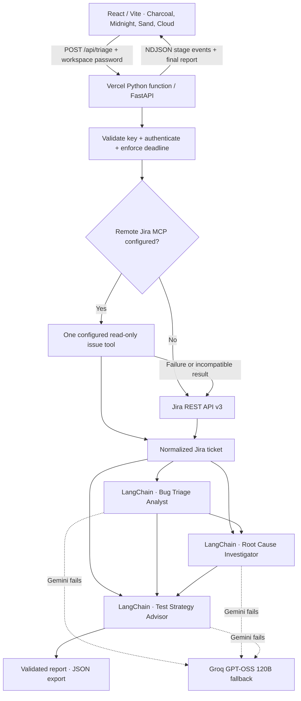

# QA Bug Triage — LangChain + Gemini Flash

A React workspace for answering three questions about a Jira defect: how bad is it, why might it happen, and what should be tested to prevent a recurrence?

Production URL: **https://qa-bug-triage-lc.vercel.app**. Deployed and HTTP-verified on 2026-09-21. DNS names are case-insensitive, so this is the requested `QA-Bug-Triage-LC.vercel.app` address.

## Stack and architecture

This implementation uses **Python + LangChain + FastAPI**, with a React/TypeScript frontend. The React UI and Python serverless API deploy in one Vercel project. Each specialist tries Google’s `gemini-flash-latest` first and automatically falls back to Groq’s `openai/gpt-oss-120b` if the Gemini request fails, times out, returns an invalid schema, or copies internal instructions. Set `GEMINI_MODEL` to a fixed supported model ID if reproducibility matters. A moving alias can change behavior over time.



1. **Bug Triage Analyst:** technical severity, business priority and category, with separate reasons, exact evidence excerpts and missing information.
2. **Root Cause Investigator:** receives the original ticket and classification; returns ranked hypotheses, subjective confidence, falsification checks, investigation steps, possible blast radius and limitations.
3. **Test Strategy Advisor:** receives the ticket and both earlier outputs; recommends verification, regression, boundary and negative tests, appropriate Unit/API/E2E/Manual layers and closure criteria.

These are three sequential role-specific LangChain prompt/model chains. They do not execute arbitrary tools, inspect repositories or run generated tests. RCA remains a hypothesis unless the supplied evidence supports more. Nothing writes comments or changes fields in Jira.

## Business case

The supplied meeting estimate is 30 people × 30 minutes × 20 days = 18,000 minutes, or **300 person-hours/month**. At $30/hour this is **$9,000/month** in meeting time. Pre-triage may recover some of that time; it is not a measured savings guarantee. The original request also gave an approximate ₹5–10 lakh range, which is not an exchange-rate calculation here.

## Local setup

Requires Python 3.14 and Node.js 22 with npm. Vercel uses Python 3.14, configured in `.python-version`. Tested Python dependencies are pinned in `requirements.txt`. Run these commands from `chapter_17_LangChain/practice`:

```powershell
python -m venv .venv
.venv\Scripts\Activate.ps1
python -m pip install -r requirements.txt
npm ci
# Populate the existing .env using .env.example as a reference.
npm run dev
```

Open `http://localhost:5173`. Vite proxies `/api` to the local API on `127.0.0.1:3001`. Restart the API after changing environment variables. On Windows, use `npm.cmd` if your PowerShell policy blocks `npm.ps1`.

| Variable | Purpose |
| --- | --- |
| `GEMINI_API_KEY` or `GOOGLE_API_KEY` | Server-side Google API key; GOOGLE_API_KEY takes precedence if both are present |
| `GEMINI_MODEL` | Optional; defaults to `gemini-flash-latest` |
| `GROQ_API_KEY` | Server-side Groq key for the `openai/gpt-oss-120b` fallback; either Gemini or Groq key is required |
| `JIRA_BASE_URL` | Jira Cloud origin, e.g. `https://team.atlassian.net` |
| `JIRA_EMAIL`, `JIRA_API_TOKEN` | Jira REST service-account credentials with read access to intended tickets |
| `APP_ACCESS_TOKEN` | Workspace password, minimum 16 characters; required to run live analysis |
| `JIRA_MCP_URL` | Optional HTTPS Streamable HTTP MCP endpoint |
| `JIRA_MCP_TOKEN` | Optional existing bearer token for that MCP server |
| `JIRA_MCP_TOOL` | Read-only get-issue tool name; default `jira_get_issue` |
| `JIRA_MCP_ISSUE_ARG` | Issue argument name; default `issue_key` |
| `JIRA_MCP_EXTRA_ARGS` | JSON object containing additional fixed tool parameters |
| `VERCEL_TOKEN` | Deployment only; never uploaded as an application variable |
| `VERCEL_SCOPE` | Optional team slug; required when multiple teams are accessible |

The deployment script generates `APP_ACCESS_TOKEN` in the local `.env` if absent. To run locally before deployment, add a strong value yourself. Enter this value in the **Workspace access password** input. It stays in React memory and is not persisted to browser storage. Activating the virtual environment ensures `npm run dev` and `npm test` use the installed Python dependencies. You can also run `.venv\Scripts\python.exe -m uvicorn backend.app:app --host 127.0.0.1 --port 3001` and `npx vite` in separate terminals.

**Never prefix a secret with `VITE_`.** Vite-prefixed variables are intended for browser bundles. `.env` is excluded from Git and deployment uploads; only explicitly allowlisted application variables are sent through Vercel’s environment API.

## Jira MCP and fallback

By default the server reads `GET /rest/api/3/issue/{key}` with selected fields. It converts nested Atlassian Document Format descriptions to text and includes status, priority and components. It does not fetch attachments, linked issues or comments. The description is capped at 24,000 characters; truncation is visible in report warnings. The authenticated `POST /api/ticket` route reads an issue without invoking Gemini or Groq.

If MCP is configured, one named tool is called with the issue key and fixed extra arguments. The tool must return the Jira v3 issue shape `{ "key": "QA-123", "fields": { "summary": "...", "description": ... } }`, either as structured content or JSON in a text block. Identity and summary are validated. Different MCP response envelopes need an adapter in `backend/jira.py`.

MCP has a 15-second budget. Failures, expired auth, malformed data or unsupported response formats trigger live REST fallback with a visible warning. This is not an interactive OAuth client; configure a compatible endpoint and bearer token. Never configure a mutating tool. REST errors fail visibly; there is no silent switch to old tickets or demo data. Transient HTTP 429/5xx responses receive bounded retries, while authentication failures do not.

## UI

- Moon and Sun buttons select dark and light mode.
- Dark palettes: **Charcoal** (default) and Midnight. Light palettes: **Sand** (default) and Cloud.
- Mode and per-mode palette choices persist locally; ticket reports and passwords do not.
- Stage progress comes from server events, with cancellation, inline error messages, and incomplete-stream detection.
- A fallback stage displays “Trying Groq”; the report identifies the model or models that produced its sections.
- **Read Jira ticket** loads the issue title, status, filed priority, components and a filtered description, with an **Open in Jira** link. The ticket also appears as soon as a triage run fetches it, even if later analysis fails.
- Triage, RCA and test strategy tabs keep all three outputs accessible. Reports export as JSON.
- Internal role/system prompts are kept server-side. The backend rejects any generated section that copies those instructions, then tries Groq if the leak came from Gemini. The ticket preview removes lines that match internal role instructions; the full original remains available through the Jira link.
- **Explore a sample report** is an explicitly labeled, offline illustrative nPVR report. It does not call Jira or Gemini. The synthetic cancellation flow expects `ServiceNotAllowed`; it does not contain the real MTP-7061 ticket or reporter identity.

## Deploy to Vercel

```powershell
npm test
npm run build
npm run deploy
```

`scripts/deploy.mjs` reads the local `.env`, resolves the requested Vercel team, creates or reuses `qa-bug-triage-lc`, uploads only allowlisted server environment variables for production, and deploys the project. It then assigns `qa-bug-triage-lc.vercel.app`. If the alias belongs to another account, the script will fail rather than silently choose another address. Token values are not printed. Keep the terminal output private because it contains account/project metadata.

Functions have a configured 300-second maximum; the application aborts at 270 seconds, leaving time for cleanup. Gemini has a 28-second stage budget and Groq has a 65-second fallback budget that includes one bounded 429 retry. Malformed Groq JSON receives one retry through function-calling output mode. The Vercel account must support the function duration. Each request makes three model generations plus any needed fallback attempts and may incur provider charges. The Python ASGI function streams NDJSON stage events and a final JSON report. `/api/triage` rewrites to `api/index.py`; read-only `/api/ticket` uses `api/ticket.py`.

## Verification

```powershell
npm test
npm run build
# Live provider check using synthetic evidence:
python -m backend.smoke
# Exercise a long synthetic issue through all three stages:
python -m backend.smoke --long
# Read-only Jira credential check (no ticket retrieval):
node scripts/check-jira.mjs
# Verify the deployed read-only ticket route without invoking a model:
node scripts/verify-jira-read.mjs MTP-7061
```

Python unittest tests cover input validation, authentication, nested ADF extraction, identity, truncation, MCP success/fallback, retry behavior, sequential context propagation, invalid model output, cancellation and FastAPI streaming/error handling. Live smoke tests print stage/status metadata, not ticket content or secrets. The smoke module deliberately supports synthetic evidence only, following the user's instruction not to send MTP-7061 to Gemini for verification. Browser visual checks require a connected browser.

### Recorded verification — 2026-09-21

- All 25 Python tests passed; frontend type-check and production build passed.
- `pip check` found no broken Python dependency requirements.
- Jira authentication returned HTTP 200 without fetching any issue.
- Vercel production deployment is READY and the requested alias is assigned.
- Production homepage and JS/CSS assets returned HTTP 200.
- Production Python API returned HTTP 401 without authentication and HTTP 400 for authenticated invalid input; the latter did not contact Jira or Gemini.
- Scanned public JS/CSS assets contained none of the configured API/access/deployment secret values.
- A synthetic Python/Gemini smoke check returned HTTP 503 `UNAVAILABLE` / high demand before Groq was configured. After the fallback update, all three stages completed on the synthetic fixture with Groq in 23.8 seconds; no Jira ticket was fetched or sent.
- A 14,000-character synthetic issue completed all three stages after the malformed-JSON recovery change.
- The deployed `POST /api/ticket` route returned HTTP 200 for MTP-7061 with a description and HTTPS Jira link. This was a read-only Jira check; no ticket content was sent to either model.
- Live MCP-server interoperability and browser visual/interaction checks remain unverified; no MCP endpoint or connected browser was available. Offline tests verify MCP routing and REST fallback.

Recheck deployed routing and assets with `node scripts/verify-deployment.mjs`. This command does not fetch Jira issues or invoke Gemini. The earlier Vercel CLI emitted its token in a failure diagnostic; deployment output now redacts credentials. Rotate the deployment token after setup. The deployed application does not store or need `VERCEL_TOKEN`.

## Production boundaries

The shared workspace password protects live Jira/LLM access, but everyone who knows it uses the same Jira service account. It is suitable for a small trusted workspace, not multi-tenant authorization. Before opening access to a larger organization, add SSO, per-user Jira authorization and durable rate limiting or a Vercel firewall rule. This version has no durable job queue or report database: a browser disconnect cancels an active run, and refreshing loses the report. Download JSON if you need to retain it.

Structured output is schema-validated after every stage. Gemini failures fall back to Groq at the affected stage; if both providers fail, downstream stages stop. Ticket contents are untrusted data separated from system instructions. The model has no tool execution privileges, and React renders output as text. Logs contain error types, phases and request IDs; they do not intentionally include ticket contents or credentials. On a live run the issue content is sent to Google and, when fallback is needed, Groq to perform the requested analysis; use a Jira account scoped to the intended projects.

Groq accounts can have a lower per-minute token budget than the model's context window. When a long issue reaches the fallback, the app passes bounded description excerpts to Groq (up to 6,000 characters for triage, 4,000 for RCA and 1,500 for strategy) while retaining the full ticket for the user. A report warning makes this limitation visible. The reported strategy-stage `APIStatusError` could not be tied to a specific provider HTTP status from retained logs; future errors now log the status code without logging ticket contents.

A 14,000-character synthetic-ticket run initially reproduced Groq's HTTP 400 `json_validate_failed` response. With the alternate output-mode retry, all three stages completed on the same synthetic fixture. This check did not send MTP-7061 to a model.

## Files

| Path | Responsibility |
| --- | --- |
| `src/main.tsx`, `src/styles.css` | React interface, streaming reader, palettes and export |
| `fixtures/sample_report.json`, `src/demo.ts` | Clearly labeled synthetic nPVR report |
| `backend/prompts.py` | All executable specialist system prompts |
| `backend/schemas.py`, `src/types.ts` | Pydantic runtime schemas and browser types |
| `backend/jira.py` | Python MCP client, REST fallback and ADF normalization |
| `backend/workflow.py` | Sequential Python LangChain orchestration |
| `backend/app.py`, `api/index.py` | Authenticated FastAPI streaming API / Vercel ASGI entry point |
| `backend/smoke.py` | Live Gemini smoke check with synthetic evidence only |
| `scripts/deploy.mjs` | Credential-safe deployment automation |
| `prompt.md` | User prompt history and runtime prompt reference |

## References

- [Google Gemini models and latest aliases](https://ai.google.dev/gemini-api/docs/models)
- [LangChain Python Gemini integration](https://docs.langchain.com/oss/python/integrations/chat/google_generative_ai)
- [MCP Python SDK](https://github.com/modelcontextprotocol/python-sdk)
- [Jira REST API v3 issues](https://developer.atlassian.com/cloud/jira/platform/rest/v3/api-group-issues/)
- [Vite on Vercel](https://vercel.com/docs/frameworks/frontend/vite)
- [Vercel project configuration](https://vercel.com/docs/project-configuration)
- [Vercel Python runtime](https://vercel.com/docs/functions/runtimes/python)
