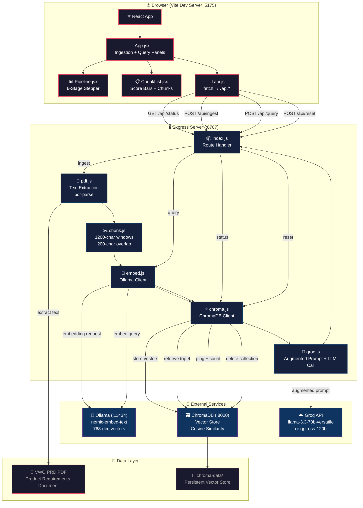

# Basic_RAG — Architecture Diagram



## Data Flow Summary

### 1. Ingestion Pipeline `POST /api/ingest`
```
PDF → pdf.js (extract text) → chunk.js (1200-char windows, 200 overlap)
    → embed.js (Ollama nomic-embed-text) → chroma.js (store in ChromaDB)
```

### 2. Query Pipeline `POST /api/query`
```
User Question → embed.js (Ollama) → chroma.js (retrieve top-4 similar chunks)
    → groq.js (build augmented prompt) → Groq API (llama-3.3-70b-versatile)
    → Answer displayed in React UI
```

## Key Architecture Decisions

| Decision | Choice | Rationale |
|---|---|---|
| Embedding | **Ollama** (local) | No API key needed, fully offline, 768-dim vectors |
| LLM | **Groq API** (cloud) | Fast inference, requires API key |
| Vector Store | **ChromaDB** | Lightweight, persistent, cosine similarity |
| Chunk Size | 1200 chars / 200 overlap | Balances context richness with retrieval precision |
| UI Framework | **React + Vite** | Fast dev experience, SPA architecture |
| Proxy | Vite proxy `/api` → Express | Single origin for dev, avoids CORS issues |
| Process Management | `concurrently` | Runs ChromaDB + Express + Vite in parallel |